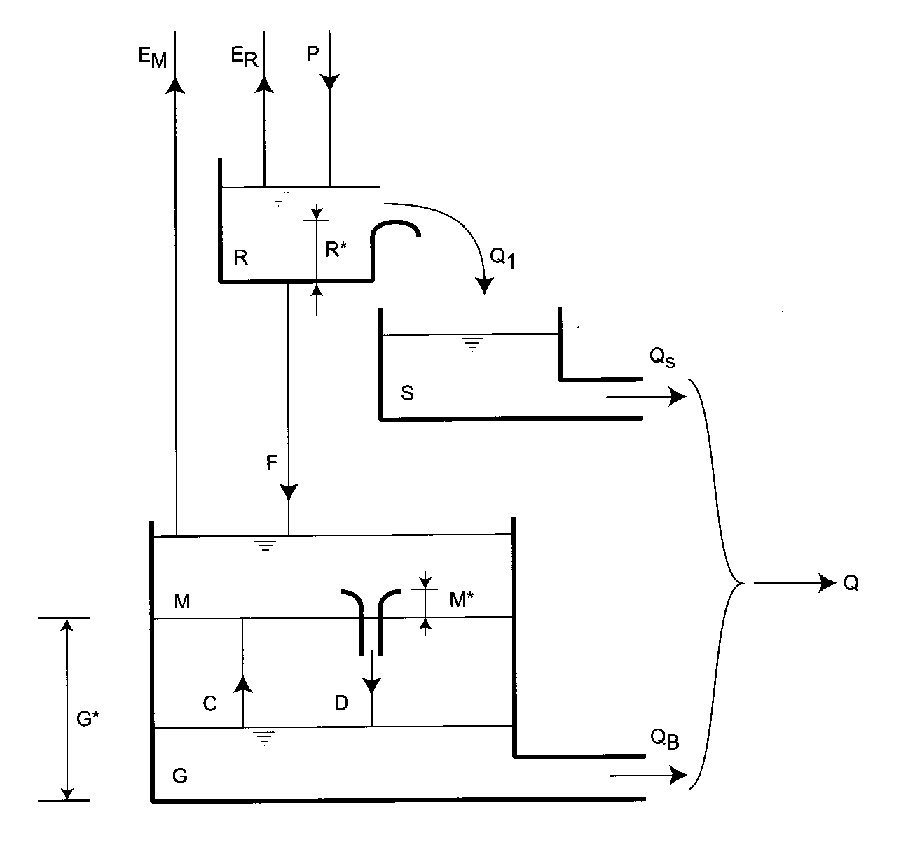
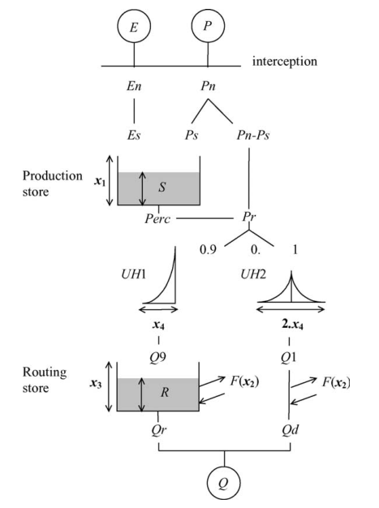
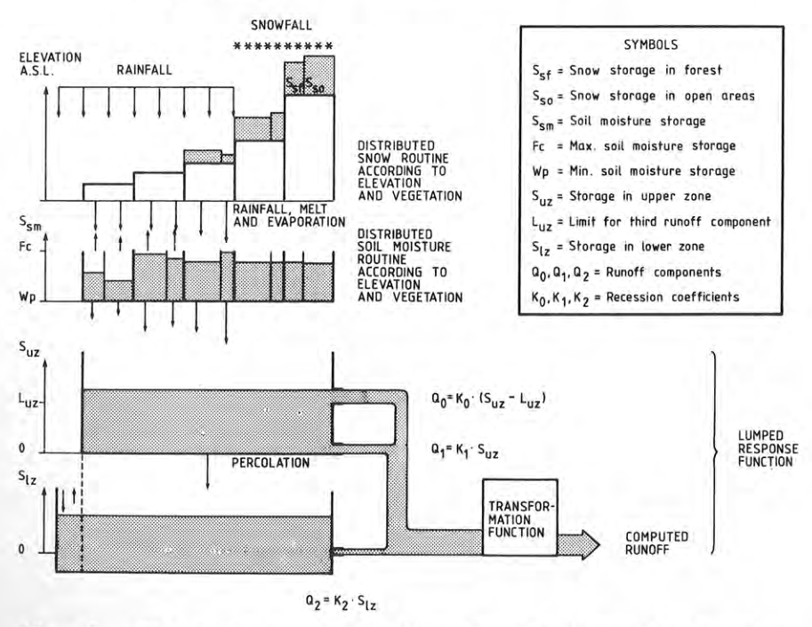
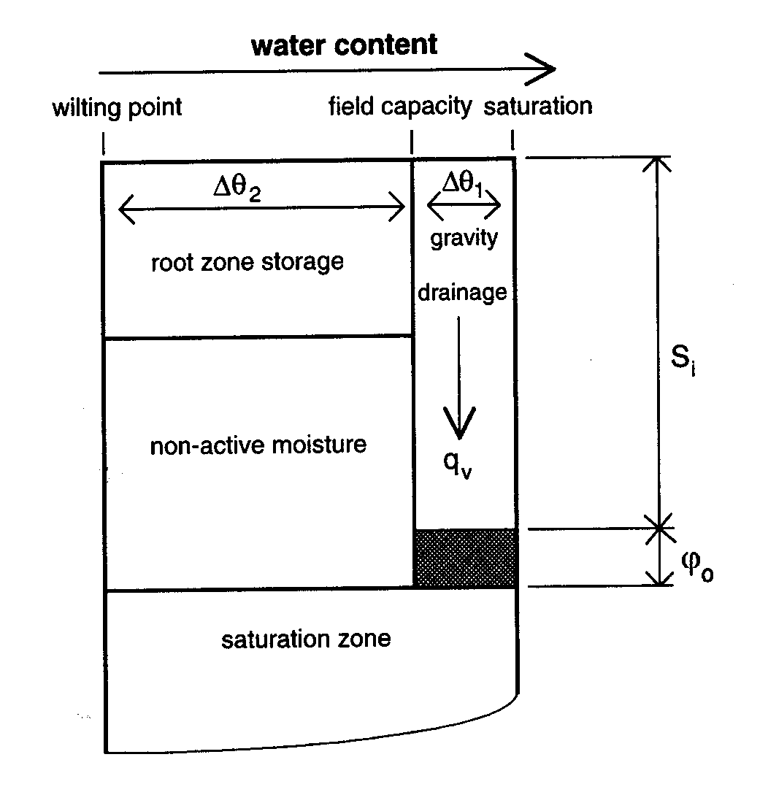
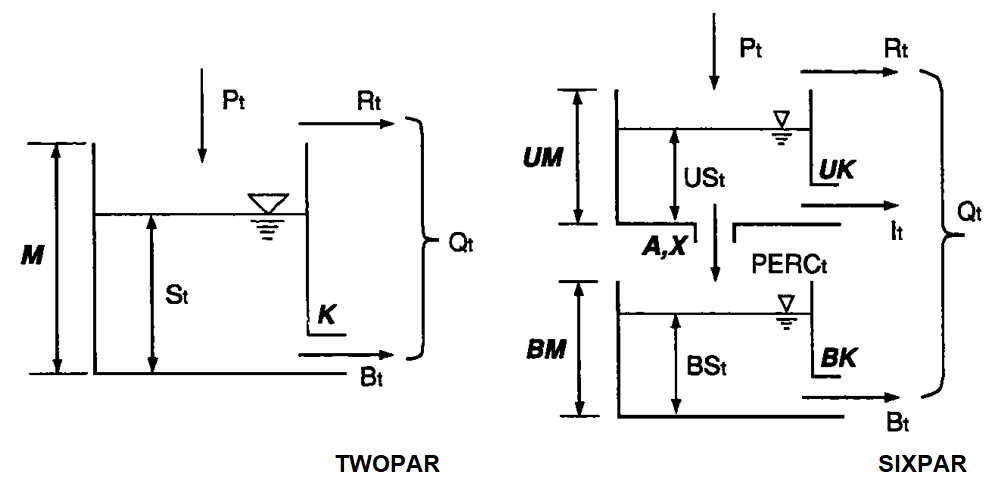
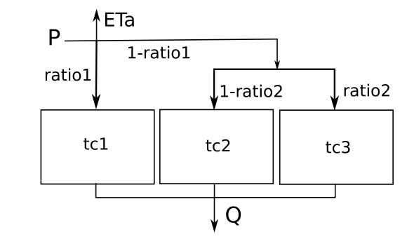

A number of rainfall-runoff models that can be applied for long-term hydrological modelling. They are "lumped" meaning that there is no consideration for processes occurring within a watershed, only it's only application is taking a climate dataset to simulate a streamflow hydrograph.

The models selected specifically because they have the ability to account for groundwater recharge rates and they include:

* The Atkinson simple storage model (Atkinson et.al., 2002, 2003; Wittenberg and Sivapalan, 1999)
* The Dawdy and O'Donnell (1965) model
* The GR4J model (Perrin et.al., 2003)
* The HBV model (Bergström, 1976, 1992; Seibert and McDonnell, 2010)
* The Manabe (1969) simple storage model with an added linear groundwater reservoir
* The multilayer capacitance model (Struthers et.al., 2003)
* The Quinn simple storage model (Quinn and Beven, 1993)
* The SIXPAR/TWOPAR model (Gupta and Sorooshian, 1983; Duan et.al., 1992)
* The simple parallel linear reservoir model (Buytaert and Beven, 2011)

Below is a brief description of the model design.

# Lumped Models

## Atkinson simple storage model

## Dawdy and O'Donnell

The Dawdy and O'Donnell (1965) model is the classic bucket type model.

*Schematic diagram of the overall model of the hydrological cycle (from Dooge and O'Kane, 2003).*

## GR4J

GR4J is a simple (i.e., parsimonious) 4-parameter model.

## HBV

The model is commonly applied in a semi-distributed manner, however it can be applied in a lumped fashion.

## Manabe

The Manabe model is simple storage model with an added linear groundwater reservoir. This is most commonly known as the "bucket" model. Manabe used this to represent land surface processes of a global circulation model.

For instance, the Dawdy and O'Donnell model (above) uses 3 Manabe-type bucket models to represent catchment hydrology.

To represent groundwater, a simple linear-decay groundwater model is added to simulate baseflow discharge.

This is the simplest of all models.

## The Multilayer Capacitance Model

A three layer model built to model Lysimeter water balances. Here a simple linear baseflow model is added to handle drainage from the bottom layer.

## Quinn

The Quinn model is the original land surface model used with TOPMODEL. When the Quinn model is used in isolation, a simple linear baseflow model is added to handle drainage.

Where the Quinn model differs is that it ca account for a shallow water table.

*A simple version of the vertical storage element in the Quinn model. $S_i$ is the local gravity drainage storage deficit, $q_v$ is local recharge to the saturated zone and $\psi_o$ is the depth of the "capillary fringe" (Beven etal., 1995).*

$$
    s_i = (\theta_s-\theta_\text{fc})(z_i-\psi_o)=\Delta\theta_1(z_i-\psi_o)
$$

## SIXPAR

The SIXPAR model is a 6-parameter model that utilizes 2 manabe buckets. This is a simpler construction of the Dawdy and O'Donnell above. SIXPAR can be further simplified to a single manabe bucket named TWOPAR. This model does not make explicit use of potential evaporation, the input is net precipitation $(P-E_p)$.

## SPLR

The simple parallel linear reservoir (SPLR) model with 3 storage reservoirs needs only 3 parameters. Like SIXPAR, this model does not make explicit use of potential evaporation, the input is net precipitation.

 

# References

Atkinson S.E., R.A. Woods, M. Sivapalan, 2002. Climate and landscape controls on water balance model complexity over changing timescales. Water Resource Research 38(12): 1314.

Atkinson, S.E., M. Sivapalan, N.R. Viney, R.A. Woods, 2003. Predicting space-time variability of hourly streamflow and the role of climate seasonality: Mahurangi Catchment, New Zealand. Hydrological Processes 17: 2171-2193.

Bergström, S., 1976. Development and application of a conceptual runoff model for Scandinavian catchments. SMHI RHO 7. Norrköping. 134 pp.

Bergström, S., 1992. The HBV model - its structure and applications. SMHI RH No 4. Norrköping. 35 pp.

Beven, K.J., R. Lamb, P.F. Quinn, R. Romanowicz, and J. Freer, 1995. TOPMODEL. In Singh V.P. editor, Computer Models of Watershed Hydrology. Water Resources Publications, Highland Ranch, CO: pp. 627—668.

Buytaert, W., and K. Beven, 2011. Models as multiple working hypotheses: hydrological simulation of tropical alpine. Hydrological Processes 25. pp. 1784–1799.

Dawdy, D.R., and T. O'Donnell, 1965. Mathematical Models of Catchment Behavior. Journal of Hydraulics Division, ASCE, Vol. 91, No. HY4: 123-137.

Dooge, J.C.I., and O'Kane, P., 2003. Deterministic Methods in Systems Hydrology: IHE Delft Lecture Note Series (1st ed.). CRC Press.

Duan, Q., S. Sorooshian, V. Gupta, 1992. Effective and Efficient Global Optimization for Conceptual Rainfall-Runoff Models. Water Resources Research 28(4): 1015-1031.

Gupta V.K., S. Sorooshian, 1983. Uniqueness and Observability of Conceptual Rainfall-Runoff Model Parameters: The Percolation Process Examined. Water Resources Research 19(1): 269-276.

Manabe, S., 1969. Climate and the Ocean Circulation 1: The Atmospheric Circulation and The Hydrology of the Earth's Surface. Monthly Weather Review 97(11): 739-744.

Perrin C., C. Michel, V. Andreassian, 2003. Improvement of a parsimonious model for streamflow simulation. Journal of Hydrology 279: 275-289.

Quinn P.F., K.J. Beven, 1993. Spatial and temporal predictions of soil moisture dynamics, runoff, variable source areas and evapotranspiration for Plynlimon, mid-Wales. Hydrological Processes 7: 425-448.

Seibert, J. and J.J. McDonnell, 2010. Land-cover impacts on streamflow: a change-detection modelling approach that incorporates parameter uncertainty. Hydrological Sciences Journal 55(3): 316-332.

Struthers, I., C. Hinz, M. Sivapalan, G. Deutschmann, F. Beese, R. Meissner, 2003. Modelling the water balance of a free-draining lysimeter using the downward approach. Hydrological Processes (17): 2151-2169.

Wittenberg H., M. Sivapalan, 1999. Watershed groundwater balance equation using streamflow recession analysis and baseflow separation. Journal of Hydrology 219: 20-33.