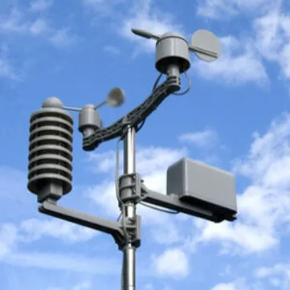

Instrumental to the water resources management of the Oak Ridges Moraine area is the accurate characterization of the regional climate. The database maintained by the Oak Ridges Moraine program houses updated meteorological data made available from Environment Canada and partner agencies. From these data, standard analysis is performed to gather insight on the energy and water balances occurring on the land surface that have a direct impact on the region’s groundwater resources. A summary map and discussion of the climate across the study area can be found [here](https://owrc.github.io/snapshots/md/met-annuals.html).

On a seasonal basis, precipitation that falls to the surface will either recharge the groundwater supply, runoff to stream channels, or evaporate back to the atmosphere. The program’s database maintains measured precipitation and streamflow, however evaporation lost to the atmosphere needs to be determined in order to estimate groundwater recharge.

Evapotranspiration is a conceptual term that captures liquid water evaporating from a wet surface, and water that is drawn by plants and transpired during biomass production. It is consistently the dominant water budget element in the Oak Ridges Moraine region; however, it is very difficult to quantify, because in most cases it is not possible to directly measure.

Understanding the amount of groundwater recharge thus requires an understanding of how the atmosphere interacts with the land surface, which involves consideration of:

* Precipitation (in the form of rain and snow)
* Air temperature
* Solar irradiation
* The moisture content of air and soil
* Wind speeds and direction
* The distribution of land use type and function

In the Oak Ridges Moraine region, the strength of the atmosphere’s evaporative demand is seasonal, being strongest in the summer when temperatures are hot and the days are long and the vegetative cover is growing and actively utilizing moisture from the ground. Conversely, with colder temperatures and with plants dormant, the evaporative demand is minimal in the winter months. Coincidentally, during the cold months, precipitation falling as snow accumulates until the spring season when the snowpack begins to melt. With melting occurring during a period of relatively low evaporation demand, snow melt tends to be a major contributor to annual groundwater recharge rates.

The program has run recharge/runoff modelling to provide estimates of water budget components across the study area. Due to the technical sophistication of the work, the results of these modelling analyses are made available to partner agency staff and consultants undertaking technical studies in the area. A recently created updated recharge runoff model is described [here](https://owrc.github.io/interpolants/modelling/waterbudgetmodel.html) and will soon be available through the Partner login mapping pages.
