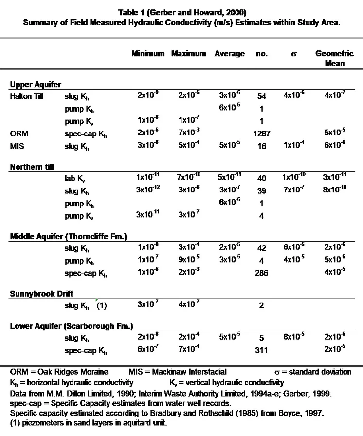
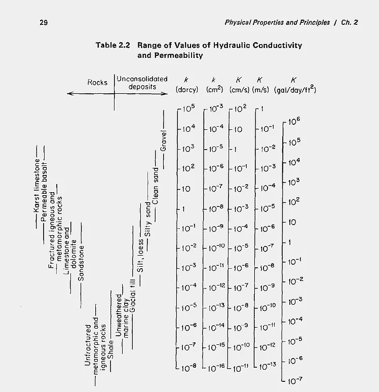
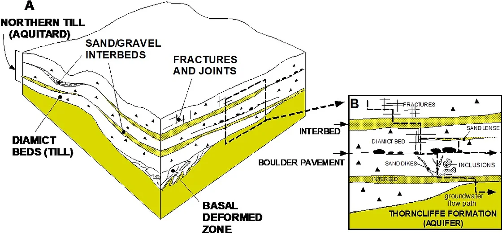

# Hydraulic Properties

Groundwater flow through porous media depends on six basic physical properties.  For water they are density $(\rho)$, viscosity $(\mu)$ and compressibility $(\beta)$; and for the media porosity ($n$, or void ratio $e$), permeability $(k)$ and compressibility $(\alpha)$.  For porous media, porosity can be further subdivided into total porosity and effective porosity, the latter term referring to the degree of interconnectedness of the pore spaces through which a fluid flows.  Commonly used porous media parameters including hydraulic conductivity (K), specific storage $(S_s)$, storativity $(S)$ and transmissivity $(T)$ are derived from these basic properties (Freeze and Cherry, 1979; Domenico and Schwartz, 1990). 

The text below provides hydraulic conductivity estimate considerations for the study area.  It is anticipated that summaries of hydraulic conductivity data and other hydrogeologic parameter estimates (e.g. porosity, Storativity, Transmissivity) will be provided once the data have been more fully collated and compiled within the program database.

## Hydraulic Conductivity

Hydraulic Conductivity $(K)$ is a parameter that describes the capacity of a soil or rock unit to transmit water and is dependent on the properties of both the fluid and the matrix (e.g. Bear, 1979; Freeze and Cherry, 1979; Domenico and Schwartz, 1990).  Based on the six basic physical properties above it is defined as:

$$
    K=\frac{(k \rho g)}{\mu},
$$

where $g$ is the acceleration due to gravity.

Hydraulic conductivity varies over a wide range depending on the rock or soil unit (Figure 1) and this is true for the geologic deposits found within the study area which can be characterized as having large facies changes over very short distances.  The geologic deposits overlying bedrock within the study area reflect a sequence of alternating glacial events, leading to deposition of till sediment, and fluvial/lacustrine events leading to deposition of a wide range of sediments ranging from gravel and cobbles to clay.  The deposits within the study area are heterogeneous and as such are characterized by a large variability in hydraulic conductivity often over short distances.  While values of K should be determined locally, the estimates provided in this discussion are intended to illustrate the range of estimates reported.  

Hydraulic conductivity estimates can be obtained in two broad ways, one being through measurements in the field (e.g. slug testing, pumping tests), and the second being through various numerical modelling estimation methodologies.  Field measurements tend to reflect (to varying degrees, depending upon the type and length of testing) the hydraulic conductivity of the geological formation in the vicinity of the well screen.  Regional numerical modelling estimates would generally, but not necessarily always, reflect a more “bulk” hydraulic conductivity estimate where a practitioner has assigned a particular hydraulic conductivity value to a particular formation in order to calibrate a regional numerical groundwater flow model.

As an example of the variability in hydraulic properties, a summary of the estimated hydraulic conductivity values within the Duffins and Petticoat Creek watersheds is provided in Table 1.

**Table 1:** Summary of field measured Hydraulic Conductivity (m/s) estimates with the Duffins and Petticoat Creek watersheds.  Table from Gerber and Howard, 2000.

**Figure 1:** Range of values of Hydraulic Conductivity and Permeability.  From Freeze and Cherry,1979.

The YPDT-CAMC program has an extensive library of hydrogeological reports.  Efforts have been initiated to compile hydraulic conductivity estimates from within these reports for incorporation into the program’s database. The locations of estimates that have already been incorporated into the database are shown on Figure 2. 

**Figure 2:**  Locations of hydraulic conductivity estimates within the database.  Data from various sources listed in References.

Determining the hydraulic conductivity of aquitard units is more difficult than for aquifers owing to the longer timeframes needed to induce and measure a hydraulic response and because secondary permeability structures such as fractures become important  (Bradbury et al., 2006; Cherry et al., 2006; Konikow and Neuzil, 2007).  This is particularly true for the three major aquitards present within the study area (Halton Till/Upper Newmarket Till; Lower Newmarket till, and Sunnybrook Drift).  Hydrogeologic investigations conducted by MM Dillon Limited (MM Dillon Limited, 1990; Interim Waste Authority, 1994a-e) and continued by Gerber (Gerber, 1999; Gerber and Howard, 1996, 2000; and Gerber et al., 2001) suggest that the Lower Newmarket till aquitard can be considered a dual porosity (and therefore a dual hydraulic conductivity) medium with bulk hydraulic conductivity (K) controlled by non-matrix structures or pathways (Figure 3; Gerber et al., 2001).  Horizontal pathways include sand and gravel interbeds and boulder pavements marking erosional surfaces.  These have been identified in the Newmarket Till in outcrop and shallow seismic reflection profiles (Boyce et al., 1995 and Boyce et al., 1997).  Vertical pathways include fractures, sand dykes, and steeply-dipping shear surfaces.  Isotopic data (2H, 18O and 3H) and regional water balance/groundwater flow modeling (Gerber, 1999) suggest vertical bulk K values on the order of 5×10-9 to 10-10m/s.  Hydraulic conductivity estimates for the Newmarket Till matrix material which were obtained from triaxial permeability and slug testing, in contrast, yield much lower estimates ranging from 10-11 to 10-10 m/s.  Based on the K estimates and on modelling studies, the vertical leakage through the Newmarket Till to the underlying Thorncliffe Aquifer is estimated at 30-40 mm/yr on a regional basis.  The amount of vertical leakage will differ where the till has been eroded or even entirely removed by meltwater erosion (tunnel channels) and will depend on the nature of channel infill sediments and vertical hydraulic gradients.

Figure 3: Conceptual model of the internal architecture of the Newmarket/Northern Till aquitard (from Gerber et al., 2001).
