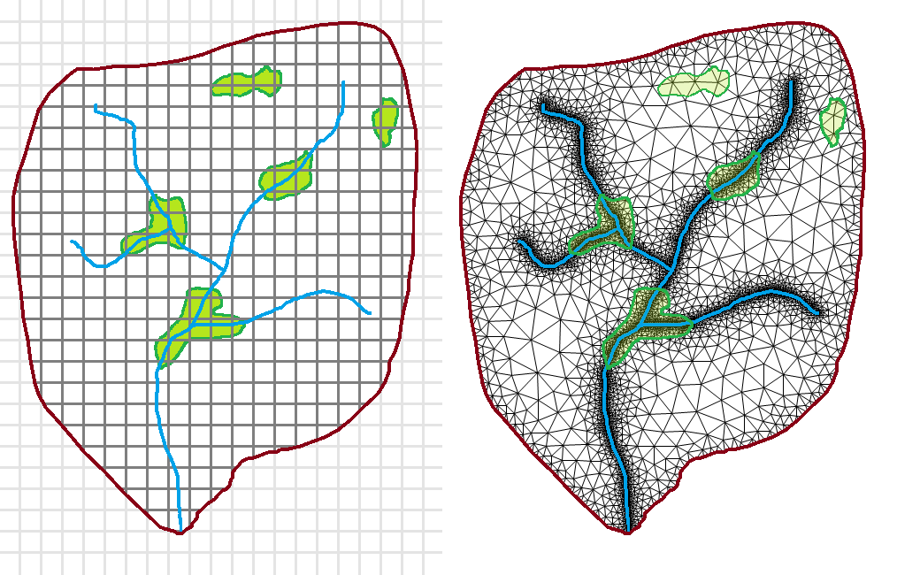
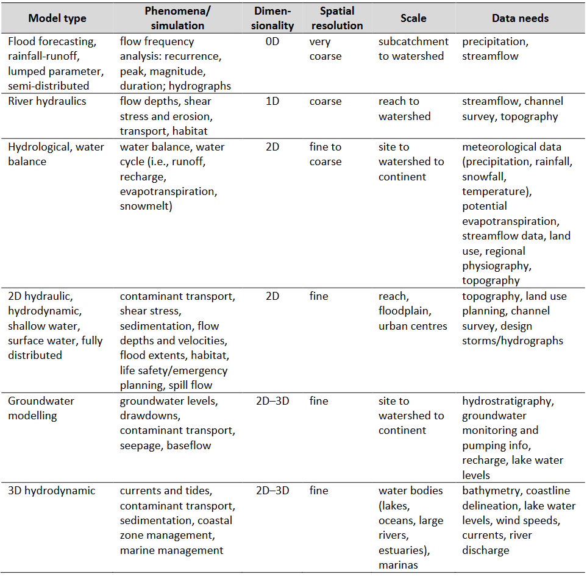

# Lumped vs. HRU vs. Distributed vs. Integrated

> from [Marchildon, Arnold, Holysh, Gerber, 2017. *A Guide for Actively Managing Watershed-Scale Numerical Models in Ontario, 147pp.*](https://www.oakridgeswater.ca/_files/ugd/4a0a6e_c41c71a481ea4657806e1fbb0c912f7a.pdf)

## Lumped model

*i.e., the "bucket" model*

### Water Budget

$$ P=E+R+G+\Delta S $$

- $P$ precipitation (i.e., rainfall $+$ snowmelt)
- $E$ evaporation (a.k.a., evapotranspiration)
- $R$ runoff
- $G$ groundwater recharge

### Examples

* The GR4J model (Perrin et.al., 2003)
* The HBV model (Bergström, 1976)
* The Thornthwaite and Mather (1955) monthly water balance model

## Hydrologic Response Unit

### Water Budget

$$ \sum_i^n \left( P_i=E_i+R_i+G_i+\Delta S_i \right) $$

### Examples

* GAWSER
* HEC-HMS
* HSP-F
* The PRMS model
* The Raven model

## Distributed

### Water Budget

$$ \sum_i^n \left( P_i+O_i=E_i+R_i+G_i+\Delta S_i \right)  $$

- $O$ runon (i.e., runoff from upslope sources added to $P$)

### Examples

* HEC-HMS
* The PRMS model
* The Raven model
* MIKE SHE

## Integrated

### Water Budget

$$ P+O+D=E+R+G+\Delta S $$

- $D$ groundwater discharge to surface

### Examples

* HydroGeosphere
* GSFLOW
* MIKE SHE

## Summary

*Characteristics of environmental model types used in watershed-scale hydrological models (Marchildon et.al., 2017).*

 

# Comparison

<iframe src="https://golang.oakridgeswater.ca/pages/Raven23WB-compare.html" width="100%" height="400" scrolling="no" allowfullscreen></iframe>

_Comparison of groundwater recharge simulated using Raven vs. an integrated groundwater/surface water model (mm/yr). Notice how in the integrated case much of the low lying areas exhibit negative "net recharge", meaning that these are area where water tables are high and seepage to the surface is being simulated._

 

# References

Alley, W.M., 1984. Onthe the Treatment of Evapotranspiration, Soil Moisture Accounting, and Aquifer Recharge in Monthly Water Balance Models. Water Resources Research 20(8): 1137-1149.

Bergström, S., 1976. Development and application of a conceptual runoff model for Scandinavian catchments. SMHI RHO 7. Norrköping. 134 pp.

Perrin C., C. Michel, V. Andreassian, 2003. Improvement of a parsimonious model for streamflow simulation. Journal of Hydrology 279: 275-289.

Thornthwaite, C.W., and J.R. Mather 1955. The Water Balance, Publications in Climatology VIII(1): 1-104, Drexel Institute of Climatology, Centerton, New Jersey. 